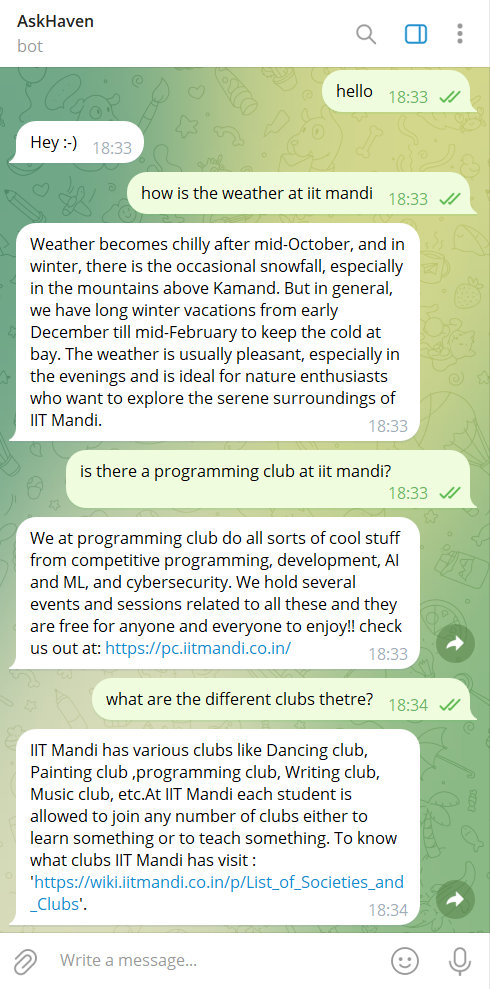

# AskHaven
**AskHaven** is a Telegram chatbot designed to assist first-year students with a variety of queries related to their college life, programming questions, and general information. AskHaven provides instant responses to common queries, helping students get quick answers for their needs.

## Usage Instructions

To start using AskHaven, follow these steps:

1. Open Telegram and search for **@askhaven_bot**.
2. Alternatively, click [here to open the bot](https://t.me/askhaven_bot).
3. Type `/start` to begin interacting with the bot.
4. You can type queries, and the bot will respond based on the available intents.

The bot accepts the following commands:

- **/start** : This starts the bot and it is now ready to receive queries.


AskHaven is able to answer queries of the following type:

- General : Telling jokes, my age, cheering up the mood!
- GCS : FAQs asked by freshers about various things related to college
- programming : PC club queries, programming errors, suggestions, doubts and any other programming related queries!





## Documentation

### Database

The database is written in a JSON format.  This is how it looks:


```json
{
	"queries": [
		{
			"tag": "greeting",
			"patterns": [
				"Hi", "Hey", "How are you?", "Hello", "What's up?"
			],
			"responses": [
				"Hello! How can I assist you today?", "Hey! What can I do for you?", "Hi there! Feel free to ask me anything."
			]
		},
		{
			"tag": "programming",
			"patterns": [
				"How to start programming?", "What is a good resource for learning programming?", "I have an error in my code. Can you help?",
				"Tell me about competitive programming.", "How do I debug my code?"
			],
			"responses": [
				"Here is a helpful guide on starting programming: [How to Start Programming](https://www.geeksforgeeks.org/how-to-start-learning-programming/).",
				"To improve in competitive programming, practice is key! Try solving problems on websites like Codeforces, LeetCode, and HackerRank.",
				"Please share your code, and I'll help you with debugging."
			]
		},
		{
			"tag": "gcs",
			"patterns": [
				"What is the first-year syllabus?", "What should I know before starting my first year?", "How do I balance studies and extracurriculars?",
				"Where can I find hostel-related info?", "How do I make friends in college?"
			],
			"responses": [
				"Here is the link to the first-year syllabus: [First Year Syllabus](https://www.college.com/first-year-syllabus).",
				"Balancing studies and extracurriculars requires time management. Try organizing your schedule to make room for both!",
				"For hostel-related information, check the hostel office or visit the official portal here: [Hostel Info](https://www.college.com/hostel-info)."
			]
		}
	]
}
```

Terms used:

- **patterns** : All different queries that a user might enter are put in the "patterns".
- **responses** : After interpreting the user’s query, the chatbot will have to reply to the query and this reply will be randomly selected from the set of predefined replies in **“responses”**
- **tag** : groups a set of similar patterns and responses to a specific category so that it’ll be easier for the model to predict which category a particular pattern represents.
